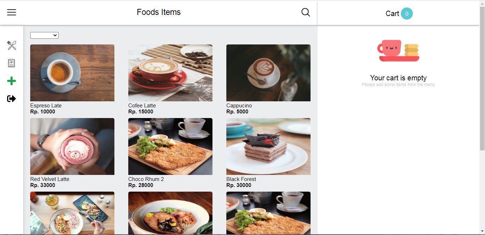

<h1 align="center">Ini Cafe App</h1>

  Dibangun dengan Vue JS

## Table of Contents

- [Introduction](#introduction)
- [Requirements](#requirements)
- [Screenshots](#screenshots)
- [Related Project](#related-project-backend)

## Introduction

<b>Ini Cafe</b> adalah aplikasi post app yang digunakan untuk pemesanan makanan

## Requirements

- [`npm`](https://www.npmjs.com/get-npm)
- [`Vue cli`](https://cli.vuejs.org/guide/installation.html)
- [`Backend Ini Cafe`](https://github.com/hamdan-hamdani/ini-cafe-express/tree/backend)

## Screenshots

       
    
    

       
    

## Related Project (Backend)

- [`Backend Ini Cafe`](https://github.com/hamdan-hamdani/ini-cafe-express/tree/backend)